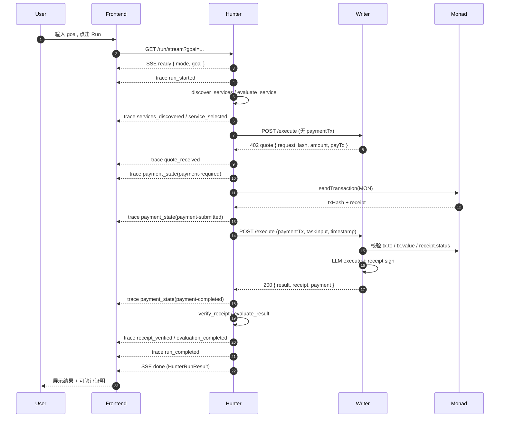
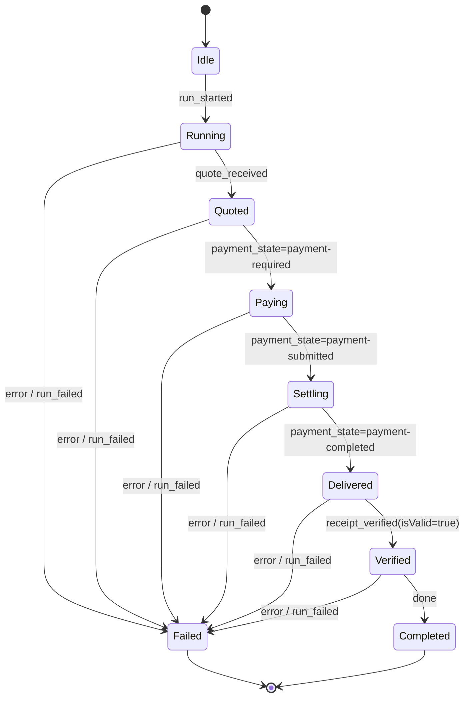
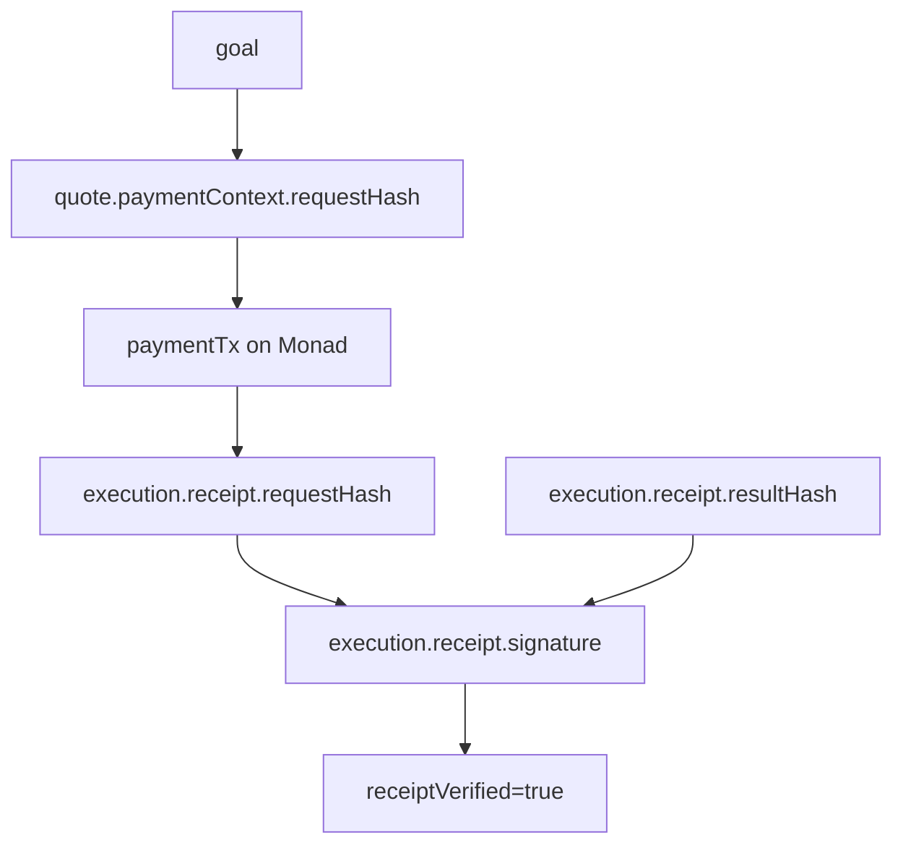

# Rebel Agent Mesh — Run Flow Graph

## 0. 双层系统总览（Architecture 风格）

```text
                    ┌──────────────────────────────────────────┐
                    │               User Intent                 │
                    │      "Write a concise Monad analysis"    │
                    └─────────────────────┬────────────────────┘
                                          │
                                          ▼
┌────────────────────────────────────────────────────────────────────────────┐
│                         Application Layer (Default UI)                     │
│                                                                            │
│  ┌───────────────┐   run/stream   ┌─────────────────────────────────────┐  │
│  │   Frontend    │ <────────────> │            Hunter Agent             │  │
│  │ Task Workspace│                │ ReAct Planner + Tools Orchestrator  │  │
│  │ Result Canvas │                │ discover/evaluate/pay/verify/eval   │  │
│  └───────────────┘                └──────────────────┬──────────────────┘  │
└───────────────────────────────────────────────────────┼────────────────────┘
                                                        │ tool calls
                                                        ▼
┌────────────────────────────────────────────────────────────────────────────┐
│                         Infrastructure Layer (Proof UI)                    │
│                                                                            │
│  ┌──────────────────────┐       tx/payment        ┌──────────────────────┐ │
│  │     Writer Agent     │ <─────────────────────> │   Monad Testnet      │ │
│  │ x402 Quote + Execute │                         │   eip155:10143       │ │
│  │ Receipt Signer       │                         │   settlement layer    │ │
│  └───────────┬──────────┘                         └───────────┬──────────┘ │
│              │ receipt + status                              │ tx proof    │
│              └──────────────────────────┬────────────────────┘             │
│                                         ▼                                  │
│                          Proof Chain (for UI drawer)                       │
│             requestHash -> paymentTx -> receipt.signature -> verified       │
└────────────────────────────────────────────────────────────────────────────┘
```

这个图的阅读方式：

1. 上半部分是用户实际使用的应用层（输入目标、看进度、拿结果）。
2. 下半部分是可信结算与可验证交付的基础设施层（支付与证明）。
3. 前端默认聚焦应用层，按需展开基础设施证明链。

## 1. End-to-End Sequence (Application + Infra)



## 2. Frontend State Machine



## 3. Proof Chain Graph



说明：

1. 应用层主价值：`goal -> result -> actionability`。
2. Infra 主价值：`requestHash -> paymentTx -> signature -> verified`。
3. 前端默认先展示应用层结果，证明链放在可展开的 Proof 面板中。
